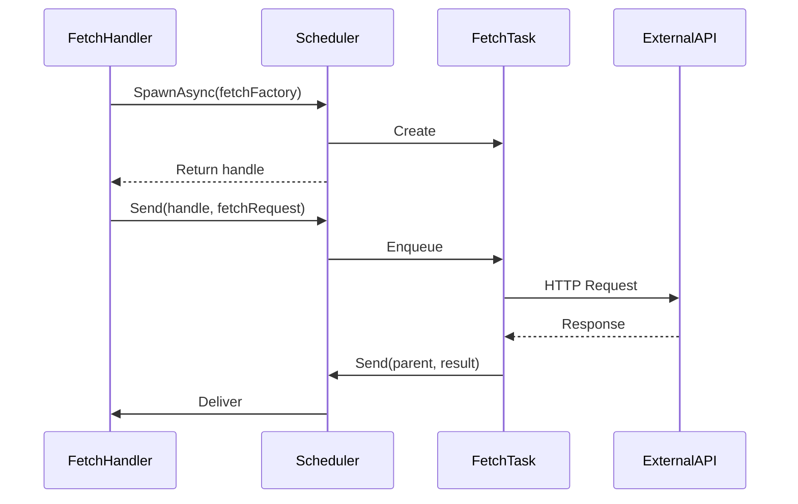
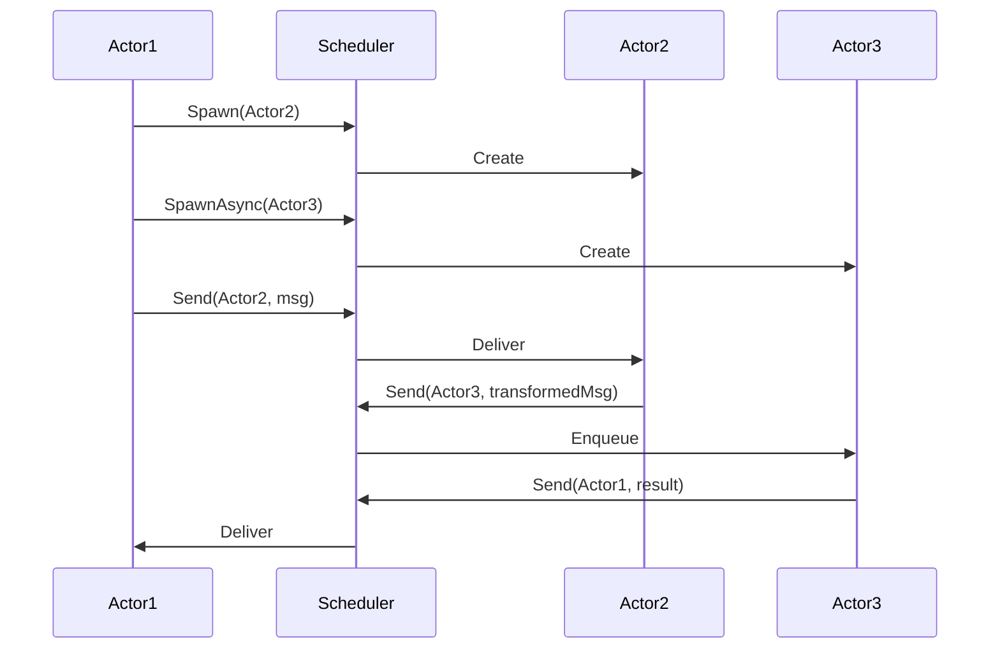
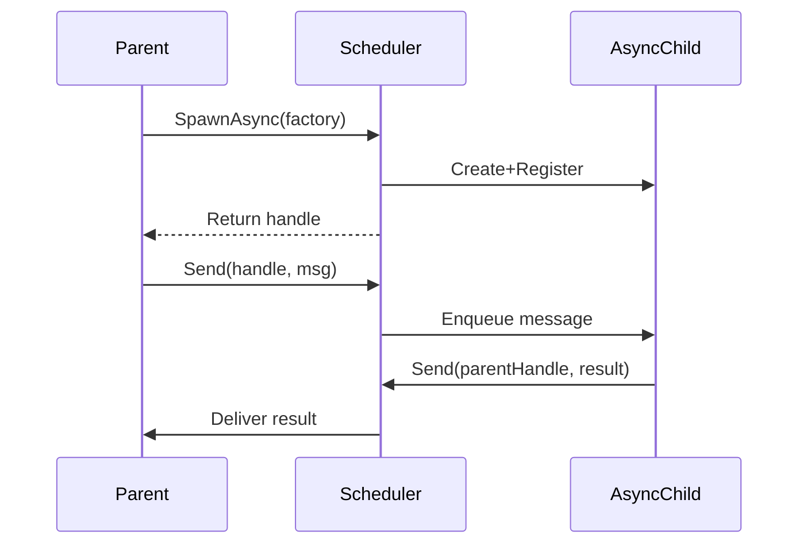

# Reactive Kit Actor System: Detailed Design Document

This document provides a comprehensive overview of the Reactive Kit reactivity framework. It explains the core architecture, key primitives, and message flow patterns used in the framework to enable reactive, deterministic, and testable applications.

---

## Introduction

### Background and Context

Reactive Kit provides a framework for building reliable real-time JavaScript/TypeScript applications, providing a robust reactive framework that leverages an actor-based concurrency model.

It enforces message-driven communication, structured hierarchical spawning of actors, and deterministic scheduling—all essential for simplifying complex concurrency scenarios and ensuring predictable behavior.

---

## Table of Contents

1. [ReactiveKit Architecture Overview](#1-reactivekit-architecture-overview)
   - [Dual-Realm Design](#11-dual-realm-design)
     - [Synchronous Realm ('Micro')](#synchronous-realm-micro)
     - [Asynchronous Realm ('Macro')](#asynchronous-realm-macro)
     - [Interaction Between Realms](#interaction-between-realms)
2. [Reactive Functions](#2-reactive-functions)
   - [Key Characteristics](#key-characteristics)
   - [Execution Model](#execution-model)
   - [Integration and Parallel Execution](#integration-and-parallel-execution)
   - [Caveats](#caveats)
3. [Actor System Overview](#3-actor-system-overview)
4. [Key Primitives](#4-key-primitives)
   - [Messages](#41-messages)
   - [Scheduler](#42-scheduler)
   - [Actors](#43-actors)
   - [Message Handlers](#44-message-handlers)
5. [Message Flow Patterns](#5-message-flow-patterns)
   - [Async Task with External System](#51-async-task-with-external-system)
   - [Multi-Actor Collaboration](#52-multi-actor-collaboration)
   - [Sync Parent → Async Child Communication](#53-sync-parent--async-child-communication)
6. [Effect System](#6-effect-system)
   - [Overview](#overview)
   - [Key Concepts](#key-concepts)
   - [Key Message Types](#key-message-types)

---

## 1. ReactiveKit Architecture Overview

### 1.1 Dual-Realm Design

- Synchronous Realm ('Micro'):
   - Role and Functionality:
      - Implemented via 'reactive functions', this realm focuses on pure computations and deterministic outputs.
      - Reactive functions within this realm compute values based on the current state, triggering recomputations as necessary when dependencies change.
      - It operates independently of the actor realm, similar to React's render phase.
   - Characteristics:
      - Ensures that computations are performed in a deterministic manner, providing consistent results for given inputs.
      - Abstracts side effects through effect hooks, maintaining a clean separation between computation and effect handling.
   - Integration:
      - Works closely with the asynchronous realm to trigger recomputations when necessary, ensuring that state changes are reflected accurately.

- Asynchronous Realm ('Macro'):
   - Role and Functionality:
      - Implemted via the actor system, this realm handles all asynchronous operations.
      - It coordinates complex workflows, manages message-driven interactions, and schedules the evaluation of reactive functions.
   - Characteristics:
      - Operates on a message-passing model, ensuring that all communications are routed through the scheduler.
      - Supports scalability by allowing actors to be spawned dynamically to handle various tasks.
   - Integration:
      - Acts as the primary interface for external systems, handling I/O operations and other asynchronous tasks.

- Interaction Between Realms:
   - Effect-Driven Interaction:
      - The `EvaluateHandler` serves as a bridge between the asynchronous and synchronous realms, managing dependencies and scheduling recomputations.
      - The `EvaluateHandler` actor initiates evaluation of reactive functions, which perform pure computations based on the current state of the system
      - In order to determine external state not currently known to the synchronous realm, reactive functions can yield 'effects', which the `EvaluateHandler` translates into asynchronous messages.
   - Runtime Coordination:
      - The `EvaluateHandler` tracks active effect subscriptions and updates the dependency graph to ensure that changes in one realm are propagated to the other.
   - Causal Chain Tracking:
      - All side-effects can be tracked by analyzing the messages that flow through the `EvaluateHandler`. This maintains a clear causal chain across both realms and allows developers to trace the flow of data and understand the impact of changes across the system.
---

## 2. Reactive Functions

Reactive functions form the cornerstone of applications built with Reactive Kit, and allow complex real-time computations to be expressed in a synchronous style.

Reactive functions operate within the synchronous realm, and represent incremental computations that depend on external 'effects' to provide up-to-date values. They are similar to React components but are designed for general-purpose programming beyond DOM-related tasks.

### Key Characteristics

- **Async Declaration**: All reactive functions must be declared as `async` functions, simplifying the distinction between pure values and stateful expressions.
  
- **Hooks and Effects**: 
  - Hooks in Reactive Kit provide stateful behavior and effects, similar to React. However, their results must be `await`ed to retrieve values.
  - Hooks are wrappers for 'effects', which are descriptive payload objects representing stateful side-effects.
  - Unlike React, hooks in Reactive Kit can be used within conditions and try-catch blocks, eliminating the restrictions imposed by React's 'rules of hooks'.

### Execution Model

- **Compile-Time Transformation**: Reactive functions are transformed at compile-time using the Regenerator Babel transform, converting them into state machines.
  - The async function acts as a generator, with synchronous 'basic blocks' separated by 'yield points' at `await` expressions.
  - If at the point of evaluating an `await` expression, the result is already available in the evaluation cache, execution proceeds uninterrupted; otherwise, any unresolved dependencies of the expression are yielded to the caller for processing.

- **Granular Reactivity**: 
  - Inputs and outputs of every reactive computation are stored in a cache for reuse across future runs.
  - When an effect's value changes, all dependent cache entries are invalidated.
  - The `EvaluateHandler` resolves values within the asynchronous realm and resumes the reactive function with the updated value.

### Integration and Parallel Execution

- **EvaluateHandler and Cache**: 
  - The `EvaluateHandler` maintains a shared cache of effect values and results of stateful computations, accessible to all reactive functions.
  - Multiple execution paths can progress in parallel, as one `await` does not block unrelated code paths.

- **Potential for Multi-Threading**: 
  - While current evaluations are single-threaded, the design allows for potential multi-threading with minimal changes, using thread-local or shared caches with concurrency primitives.

### Caveats

- **Hashable Values**: Only hashable values can be retained across `await` boundaries
   - A good rule of thumb is that if a value can be safely serialized into JSON, it can be carried across an `await` point
   - This typically excludes class instances etc, unless they implement a custom hash function
   - This restriction exists because reactive computations are incrementally re-evaluated:
      - When state changes, the system identifies which code chunks need recomputation
      - These chunks are identified by hashing their inputs
      - If input hashes match previous evaluations, the existing result is reused
   > This will be a familiar restriction to Rust developers, who know that only thread-safe `Send` values can carried across an `await` boundary - for similar reasons

## 3. Actor System Overview

The actor system in Reactive Kit provides the backbone for managing concurrency and reactive data flows. Its design revolves around three primary concerns:

1. **Message-Driven Communication**  
   Actors interact solely through messages, which carry commands or state notifications. No actor ever directly calls methods on another actor; the system's Scheduler manages message delivery in a strictly ordered manner.

2. **Controlled Asynchronicity**  
   Actors can be synchronous or asynchronous, allowing them to process incoming messages immediately or queue them for later execution. This structure helps to split work cleanly between quick operations (e.g., state updates) and potentially long-running tasks (e.g., external I/O).

3. **Scheduler as a Message Bus**  
   The Scheduler sits at the center, spawning actors, routing messages, and enforcing deterministic behavior. By funneling all communication through one channel, Reactive Kit creates an easily traceable flow of events.

A key principle is that the system remains predictable under load. Each segment of computation—no matter how concurrent or distributed—passes through the Scheduler in a defined sequence, aiding in debugging, reproducibility, and testing.

---

## 4. Key Primitives

Reactive Kit's actor system is built on four main primitives: Messages, the Scheduler, Actors, and Message Handlers. Each of these plays a distinct role in orchestrating concurrency, enabling clear communication, and providing deterministic execution semantics. This section dives into how these building blocks work, the responsibilities they hold, and the ways they interconnect.

### 4.1 Messages

Messages are the core communication packets delivered between actors. They carry instructions, requests, or data necessary for an actor to process. Whenever an actor needs to trigger work or respond to an event, it sends a message to another actor (or back to itself) through the Scheduler.

1. **Structure**  
   - Messages encapsulate actions (e.g., "fetch data") or state-change notifications (e.g., "username updated").  
   - Messages are strongly typed: each message type has a clearly defined shape and payload. This allows actors to provide targeted behavior in response specific messages, while ignoring other unrelated messages.

2. **Routing**  
   - All messages pass through the Scheduler, which ensures a deterministic ordering and no direct function calls between actors.  
   - Actors specify a recipient handle when sending messages; the Scheduler resolves and dispatches to the correct destination.

3. **Lifecycle**  
   - Dispatched messages may be processed immediately by synchronous actors or queued for asynchronous actors.  
   - Messages can be transformed by intermediate message handlers before new actions or further notifications are triggered.

---

### 4.2 Scheduler

The Scheduler orchestrates the creation of actors and the delivery of messages, acting as a centralized message bus for the system:

1. **Central Coordination**  
   - Serves as the single point for spawning actors, routing messages, and controlling concurrency.  
   - Prevents race conditions and unclear dependencies by forcing all communication through one channel.

2. **Deterministic Execution**  
   - Synchronous messages follow a strict FIFO order, while asynchronous actors queue messages without blocking others.  
   - This uniform processing model makes debugging and testing easier, as system behavior is consistently reproducible.

3. **Unified Lifecycle Management**  
   - Spawns new actors when requested by existing ones, assigning each a unique handle.  
   - Oversees actor termination, ensuring resources are freed properly to avoid leaks.

---

### 4.3 Actors

Actors are the principal computational units in Reactive Kit, each isolating its own state and behavior.

In response to incoming messages, actors can update their internal state if needed, and send out new messages.

They can run synchronously (performing work immediately) or asynchronously (allowing queued operations), but all interaction happens via message passing.

1. **Work Model**  
   - Actors receive messages, perform operations, and optionally dispatch new messages in response.  
   - Each actor may store and mutate internal state only within message handlers.

2. **Synchronous vs. Asynchronous**  
   - Synchronous actors handle messages immediately, useful for quick tasks like local state updates or trivial transformations.  
   - Asynchronous actors queue incoming messages; they are suitable for resource-intensive or I/O-bound operations without blocking other parts of the system.

3. **Parent/Child Relationship**  
   - An actor can spawn child actors to offload tasks or modularize functionality.  
   - The parent typically delegates computations to the child, and the child reports back via messages.  
   - This model remains purely message-driven; the parent or child must route all communication through the Scheduler.

---

### 4.4 Message Handlers

Message handlers are specialized functions within an actor that define how the actor processes incoming messages and updates its local state:

1. **Actor Methods**  
   - Each handler is an actor-specific function mapped to a particular message type or category (e.g., "handleLogin," "handleFetchSuccess").

2. **Deterministic State Machines**  
   - Actors act as state machines; the only way to mutate their state is within a message handler.  
   - This approach enforces predictable outcomes: a specific message leads to a specific state transition.

3. **Actions for the Scheduler**  
   - When a message handler finishes processing, it can return actions.  
   - These actions might include sending new messages or spawning new actors, all of which the Scheduler manages.

---

## 5. Message Flow Patterns

Below are some illustrative patterns that show how Reactive Kit's actor system coordinates tasks, side-effects, and communication using the Scheduler as a central message bus.

### 5.1 Async Task with External System

Key Characteristics:

- Asynchronous actors handle calls to external systems without blocking.
- Scheduler enforces strict ordering of message dispatch and receipt.
- Parent remains responsive while waiting on external I/O.

### 5.2 Multi-Actor Collaboration

Key Characteristics:

- Multiple actors collaborate on a shared goal, passing messages through the Scheduler.
- The Scheduler prevents race conditions or direct method calls.
- Each actor can transform, enrich, or filter data before sending new messages.

### 5.3 Sync Parent → Async Child Communication

Key Characteristics:

- A parent actor spawns an asynchronous child for longer-running tasks.
- Child computations do not interfere with the parent's synchronous updates.
- Scheduler mediates every message, ensuring a deterministic sequence of events.

## 6. Effect System

### Overview

The effect system in ReactiveKit serves as a bridge between the asynchronous ('macro') and synchronous ('micro') realms, enabling reactive functions to interact with external systems and manage dependencies dynamically. This system is crucial for maintaining the reactivity and responsiveness of the application.

### Key Concepts

- **Reactive Functions and Effects:**
   - Reactive functions are effectively pure generator functions that ultimately compute a value based on intermediate stateful dependencies
   - Reactive functions work by yielding a series of `Effect` payloads that indicate which values must be provided by the runtime in order to compute the up-to-date result of the function.
   - These effects express the side-effects required by the function, allowing the asynchronous 'macro' system to manage them efficiently.
   - Once all the effects have been resolved to their latest values, the reactive function returns the current result

- **Effect Subscription:**
   - When a reactive function returns effects, an `EFFECT_SUBSCRIBE` message is sent in the asynchronous realm.
   - This message contains a typed 'effect' payload, fully describing the effect and its requirements.
   - The `EFFECT_SUBSCRIBE` message triggers effect handler actions to determine the values corresponding to the effects, potentially involving asynchronous side-effects.

- **Effect Handling and Updates**:
   - Effect handlers are responsible for resolving the values of subscribed effects. They may perform asynchronous operations to obtain these values.
   - Once resolved, the effect handler dispatches an `EFFECT_EMIT` message, which updates the EvaluateHandler actor with the new effect values.
   - The `EvaluateHandler` then re-runs the reactive function with the updated values, ensuring that the function's output reflects the current state of its dependencies.

- **Effect Unsubscription**:
   - The intermediate yielded return values of reactive functions determine the set of effects they depend on. If certain effects are no longer needed, an `EFFECT_UNSUBSCRIBE` message is dispatched.
   - This message instructs the effect handler to stop monitoring the effect, freeing up resources and preventing unnecessary updates.

### Key Message Types

- **`EFFECT_SUBSCRIBE`**:
   - Initiates the subscription process for a new effect, providing the necessary information for the effect handler to resolve its value.
- **`EFFECT_EMIT`**:
   - Communicates the resolved value of an effect back to the EvaluateHandler, triggering a re-evaluation of the reactive function.
- **`EFFECT_UNSUBSCRIBE`**:
   - Signals that an effect is no longer required by the reactive function, prompting the effect handler to cease monitoring it.
