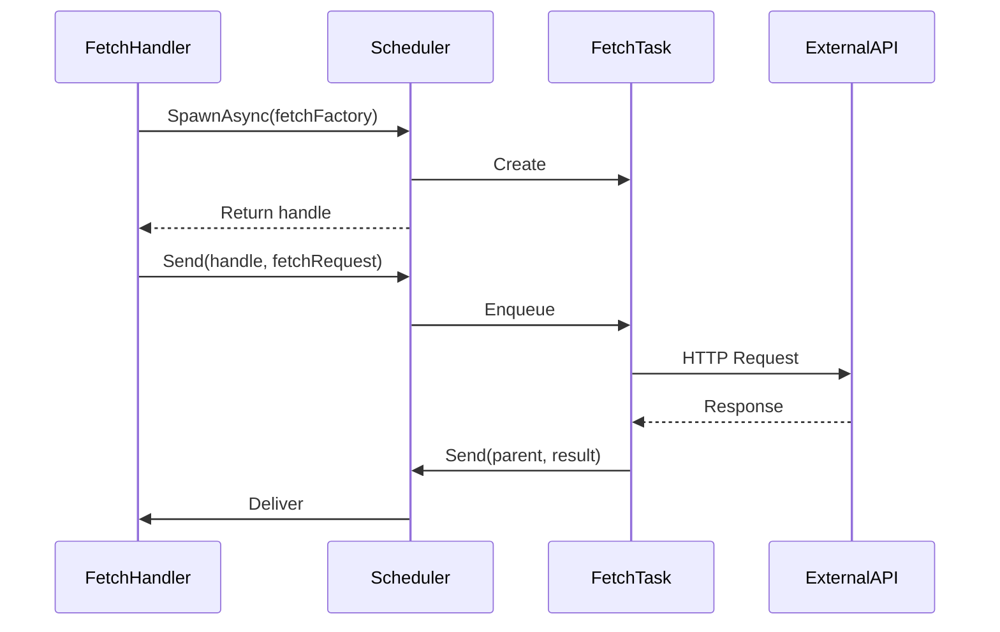
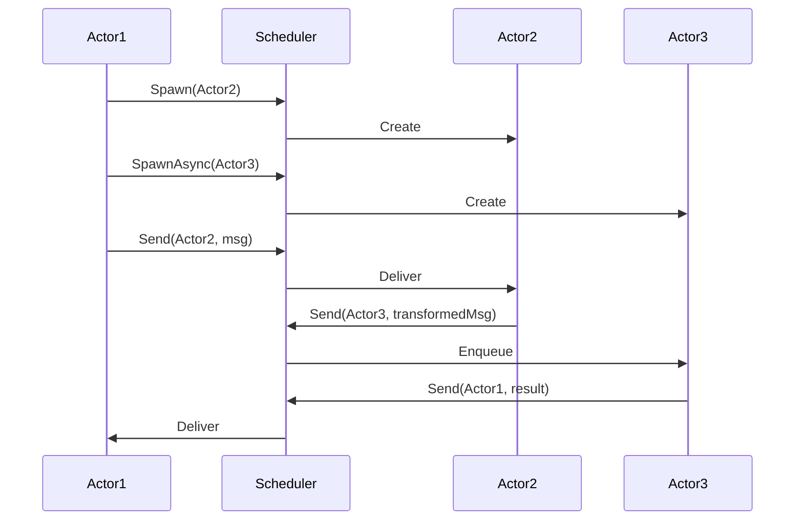
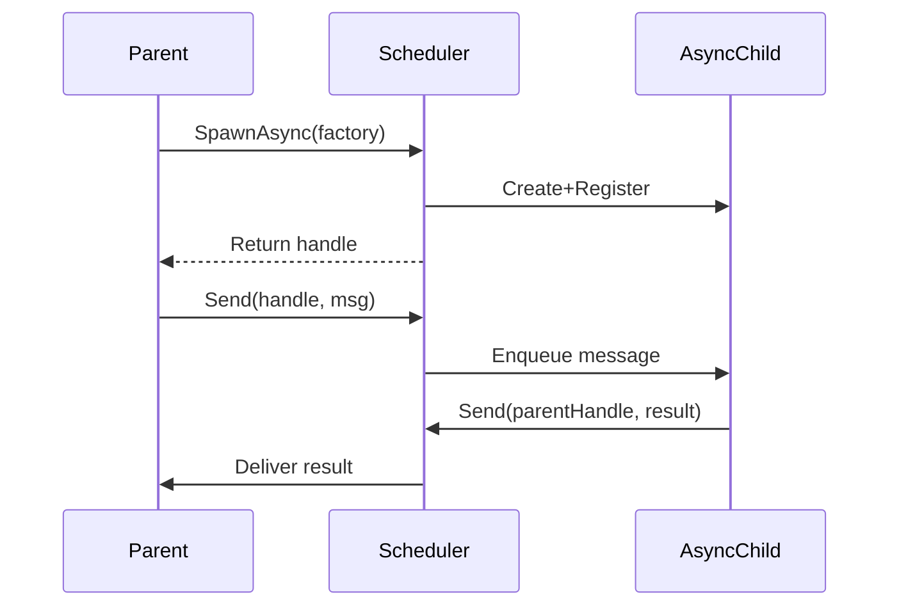

# ReactiveKit Architecture: Detailed Design Document

This document provides a comprehensive overview of ReactiveKit, a full-stack framework for building deterministic, debuggable, testable, replayable, and observable real-time distributed systems.

---

## Introduction

### Background and Context

ReactiveKit provides a unified approach to building reliable real-time JavaScript/TypeScript applications. It extends the reactive paradigm beyond UI to the entire application stack using three core building blocks that work together to eliminate the complexity typically associated with real-time systems.

The framework enforces deterministic behavior, complete observability, and perfect reproducibility—all essential for building robust production systems that can be thoroughly tested and debugged.

---

## Table of Contents

1. [ReactiveKit Architecture Overview](#1-reactivekit-architecture-overview)
   - [Three-Layer Architecture](#11-three-layer-architecture)
     - [Reactive Functions](#reactive-functions)
     - [Scripted Workers](#scripted-workers)
     - [Intelligent Transport Layer](#intelligent-transport-layer)
     - [Integration Between Layers](#integration-between-layers)
2. [Reactive Functions](#2-reactive-functions)
   - [Key Characteristics](#key-characteristics)
   - [Execution Model](#execution-model)
   - [Integration and Parallel Execution](#integration-and-parallel-execution)
   - [Caveats](#caveats)
3. [Scripted Workers](#3-scripted-workers)
   - [Actor System Foundation](#actor-system-foundation)
   - [VM-Based Execution](#vm-based-execution)
   - [Control Flow Primitives](#control-flow-primitives)
4. [Actor System Primitives](#4-actor-system-primitives)
   - [Messages](#41-messages)
   - [Scheduler](#42-scheduler)
   - [Actors](#43-actors)
   - [Message Handlers](#44-message-handlers)
5. [Message Flow Patterns](#5-message-flow-patterns)
   - [Async Task with External System](#51-async-task-with-external-system)
   - [Multi-Actor Collaboration](#52-multi-actor-collaboration)
   - [Sync Parent → Async Child Communication](#53-sync-parent--async-child-communication)
6. [Effect System](#6-effect-system)
   - [Overview](#overview)
   - [Key Concepts](#key-concepts)
   - [Key Message Types](#key-message-types)

---

## 1. ReactiveKit Architecture Overview

### 1.1 Three-Layer Architecture

ReactiveKit's architecture consists of three distinct but integrated layers that work together to provide a unified programming model across the entire application stack.

#### Reactive Functions
**Live computations that automatically stay up-to-date**

- **Purpose**: Handle synchronous, live computations that automatically recompute when dependencies change
- **Implementation**: Use familiar `async`/`await` syntax compiled to resumable state machines via Babel transformation
- **Characteristics**: 
  - Fine-grained dependency tracking through effects
  - Automatic recomputation when dependencies change
  - No manual subscriptions or caching required
  - Deterministic output for given inputs
- **Integration**: Bridge to external systems through effects managed by the intelligent transport layer
- **Use Cases**: UI components, streaming API endpoints, real-time dashboards, data transformations

#### Scripted Workers
**Stateful, repeatable procedural workflows in the actor world**

- **Purpose**: Orchestrate deterministic multi-step operations using the actor system
- **Implementation**: VM-based execution of composable control flow primitives built on the actor foundation
- **Characteristics**:
  - Message-driven communication through the scheduler
  - Stateful workflows with complete auditability
  - Deterministic execution with perfect replay
  - Suitable for both ephemeral tasks and daemon processes
- **Integration**: Communicate through the intelligent transport layer with full causal tracking
- **Use Cases**: Business workflows, data pipelines, alerting mechanisms, batch processing

#### Intelligent Transport Layer
**Deterministic, observable system backbone**

- **Purpose**: Coordinate all interactions between Reactive Functions and Scripted Workers
- **Implementation**: Ordered event bus built on the actor system's scheduler with complete causal traceability
- **Characteristics**:
  - All system interactions logged as serialized messages
  - Deterministic message ordering through the scheduler
  - Cross-service correlation and distributed tracing
  - Perfect reproducibility through event replay
- **Integration**: Serves as the foundation for both reactive functions and scripted workers
- **Benefits**: Time-travel debugging, session recording, audit trails, performance monitoring

#### Integration Between Layers

- **Effect-Driven Integration**: 
  - Reactive functions interact with external systems through effects resolved by the transport layer
  - The `EvaluateHandler` serves as a bridge, managing dependencies and scheduling recomputations
  - Effects are translated into asynchronous messages in the actor system
- **Message-Based Coordination**: Scripted workers communicate via messages routed through the scheduler
- **Causal Chain Preservation**: Complete dependency tracking across all three layers through the actor system
- **Deterministic Behavior**: Guaranteed reproducible behavior through the scheduler's deterministic message ordering

---

## 2. Reactive Functions

Reactive Functions form the cornerstone of applications built with ReactiveKit, allowing complex real-time computations to be expressed in a synchronous style. They represent incremental computations that depend on external 'effects' to provide up-to-date values, similar to React components but designed for general-purpose programming beyond DOM-related tasks.

### Key Characteristics

- **Async Declaration**: All reactive functions must be declared as `async` functions, simplifying the distinction between pure values and stateful expressions.

- **Hooks and Effects**: 
  - Hooks in ReactiveKit provide stateful behavior and effects, similar to React. However, their results must be `await`ed to retrieve values.
  - Hooks are wrappers for 'effects', which are descriptive payload objects representing stateful side-effects.
  - Unlike React, hooks in ReactiveKit can be used within conditions and try-catch blocks, eliminating the restrictions imposed by React's 'rules of hooks'.

### Execution Model

- **Compile-Time Transformation**: Reactive functions are transformed at compile-time using the Regenerator Babel transform, converting them into state machines.
  - The async function acts as a generator, with synchronous 'basic blocks' separated by 'yield points' at `await` expressions.
  - If at the point of evaluating an `await` expression, the result is already available in the evaluation cache, execution proceeds uninterrupted; otherwise, any unresolved dependencies of the expression are yielded to the caller for processing.

- **Granular Reactivity**: 
  - Inputs and outputs of every reactive computation are stored in a cache for reuse across future runs.
  - When an effect's value changes, all dependent cache entries are invalidated.
  - The `EvaluateHandler` resolves values within the asynchronous realm and resumes the reactive function with the updated value.

### Integration and Parallel Execution

- **EvaluateHandler and Cache**: 
  - The `EvaluateHandler` maintains a shared cache of effect values and results of stateful computations, accessible to all reactive functions.
  - Multiple execution paths can progress in parallel, as one `await` does not block unrelated code paths.

- **Potential for Multi-Threading**: 
  - While current evaluations are single-threaded, the design allows for potential multi-threading with minimal changes, using thread-local or shared caches with concurrency primitives.

### Caveats

- **Hashable Values**: Only hashable values can be retained across `await` boundaries
  - A good rule of thumb is that if a value can be safely serialized into JSON, it can be carried across an `await` point
  - This typically excludes class instances etc, unless they implement a custom hash function
  - This restriction exists because reactive computations are incrementally re-evaluated:
    - When state changes, the system identifies which code chunks need recomputation
    - These chunks are identified by hashing their inputs
    - If input hashes match previous evaluations, the existing result is reused
  > This will be a familiar restriction to Rust developers, who know that only thread-safe `Send` values can carried across an `await` boundary - for similar reasons

---

## 3. Scripted Workers

Scripted Workers provide stateful, repeatable procedural workflows that operate in the actor world. They are built on top of ReactiveKit's actor system foundation and enable complex business logic orchestration with full determinism and auditability.

### Actor System Foundation

The actor system in ReactiveKit provides the backbone for managing concurrency and reactive data flows. Its design revolves around three primary concerns:

1. **Message-Driven Communication**  
   Actors interact solely through messages, which carry commands or state notifications. No actor ever directly calls methods on another actor; the system's Scheduler manages message delivery in a strictly ordered manner.

2. **Controlled Asynchronicity**  
   Actors can be synchronous or asynchronous, allowing them to process incoming messages immediately or queue them for later execution. This structure helps to split work cleanly between quick operations (e.g., state updates) and potentially long-running tasks (e.g., external I/O).

3. **Scheduler as a Message Bus**  
   The Scheduler sits at the center, spawning actors, routing messages, and enforcing deterministic behavior. By funneling all communication through one channel, ReactiveKit creates an easily traceable flow of events.

A key principle is that the system remains predictable under load. Each segment of computation—no matter how concurrent or distributed—passes through the Scheduler in a defined sequence, aiding in debugging, reproducibility, and testing.

### VM-Based Execution

- **Virtual Machine**: Custom VM compiles workflow definitions into executable operations
- **Resumable Execution**: Workers can be paused and resumed at any operation
- **Deterministic Replay**: Perfect reproduction of execution through event log replay
- **State Machines**: All execution represented as deterministic state transitions

### Control Flow Primitives

Scripted Workers use composable control flow primitives built on the actor system:

**Sequential Operations:**
```javascript
sequence(() => [
  send(ServiceA, { type: 'START_PROCESS' }),
  waitFor(msg => msg.type === 'PROCESS_READY'),
  send(ServiceB, { type: 'CONTINUE_PROCESS' }),
  complete()
])
```

**Conditional Logic:**
```javascript
whenState(
  readState(handle, state => state.amount > 1000),
  send(HighValueService, { type: 'PROCESS_HIGH_VALUE' }),
  send(StandardService, { type: 'PROCESS_STANDARD' })
)
```

**State Management:**
```javascript
withState(() => ({ counter: 0 }), stateHandle =>
  modifyState(stateHandle, state => ({ counter: state.counter + 1 }))
)
```

---

## 4. Actor System Primitives

ReactiveKit's actor system is built on four main primitives: Messages, the Scheduler, Actors, and Message Handlers. Each of these plays a distinct role in orchestrating concurrency, enabling clear communication, and providing deterministic execution semantics.

### 4.1 Messages

Messages are the core communication packets delivered between actors. They carry instructions, requests, or data necessary for an actor to process. Whenever an actor needs to trigger work or respond to an event, it sends a message to another actor (or back to itself) through the Scheduler.

1. **Structure**  
   - Messages encapsulate actions (e.g., "fetch data") or state-change notifications (e.g., "username updated").  
   - Messages are strongly typed: each message type has a clearly defined shape and payload. This allows actors to provide targeted behavior in response specific messages, while ignoring other unrelated messages.

2. **Routing**  
   - All messages pass through the Scheduler, which ensures a deterministic ordering and no direct function calls between actors.  
   - Actors specify a recipient handle when sending messages; the Scheduler resolves and dispatches to the correct destination.

3. **Lifecycle**  
   - Dispatched messages may be processed immediately by synchronous actors or queued for asynchronous actors.  
   - Messages can be transformed by intermediate message handlers before new actions or further notifications are triggered.

### 4.2 Scheduler

The Scheduler orchestrates the creation of actors and the delivery of messages, acting as a centralized message bus for the system:

1. **Central Coordination**  
   - Serves as the single point for spawning actors, routing messages, and controlling concurrency.  
   - Prevents race conditions and unclear dependencies by forcing all communication through one channel.

2. **Deterministic Execution**  
   - Synchronous messages follow a strict FIFO order, while asynchronous actors queue messages without blocking others.  
   - This uniform processing model makes debugging and testing easier, as system behavior is consistently reproducible.

3. **Unified Lifecycle Management**  
   - Spawns new actors when requested by existing ones, assigning each a unique handle.  
   - Oversees actor termination, ensuring resources are freed properly to avoid leaks.

### 4.3 Actors

Actors are the principal computational units in ReactiveKit, each isolating its own state and behavior. In response to incoming messages, actors can update their internal state if needed, and send out new messages. They can run synchronously (performing work immediately) or asynchronously (allowing queued operations), but all interaction happens via message passing.

1. **Work Model**  
   - Actors receive messages, perform operations, and optionally dispatch new messages in response.  
   - Each actor may store and mutate internal state only within message handlers.

2. **Synchronous vs. Asynchronous**  
   - Synchronous actors handle messages immediately, useful for quick tasks like local state updates or trivial transformations.  
   - Asynchronous actors queue incoming messages; they are suitable for resource-intensive or I/O-bound operations without blocking other parts of the system.

3. **Parent/Child Relationship**  
   - An actor can spawn child actors to offload tasks or modularize functionality.  
   - The parent typically delegates computations to the child, and the child reports back via messages.  
   - This model remains purely message-driven; the parent or child must route all communication through the Scheduler.

### 4.4 Message Handlers

Message handlers are specialized functions within an actor that define how the actor processes incoming messages and updates its local state:

1. **Actor Methods**  
   - Each handler is an actor-specific function mapped to a particular message type or category (e.g., "handleLogin," "handleFetchSuccess").

2. **Deterministic State Machines**  
   - Actors act as state machines; the only way to mutate their state is within a message handler.  
   - This approach enforces predictable outcomes: a specific message leads to a specific state transition.

3. **Actions for the Scheduler**  
   - When a message handler finishes processing, it can return actions.  
   - These actions might include sending new messages or spawning new actors, all of which the Scheduler manages.

---

## 5. Message Flow Patterns

Below are some illustrative patterns that show how ReactiveKit's actor system coordinates tasks, side-effects, and communication using the Scheduler as a central message bus.

### 5.1 Async Task with External System



Key Characteristics:

- Asynchronous actors handle calls to external systems without blocking.
- Scheduler enforces strict ordering of message dispatch and receipt.
- Parent remains responsive while waiting on external I/O.

### 5.2 Multi-Actor Collaboration



Key Characteristics:

- Multiple actors collaborate on a shared goal, passing messages through the Scheduler.
- The Scheduler prevents race conditions or direct method calls.
- Each actor can transform, enrich, or filter data before sending new messages.

### 5.3 Sync Parent → Async Child Communication



Key Characteristics:

- A parent actor spawns an asynchronous child for longer-running tasks.
- Child computations do not interfere with the parent's synchronous updates.
- Scheduler mediates every message, ensuring a deterministic sequence of events.

---

## 6. Effect System

### Overview

The effect system in ReactiveKit serves as a bridge between Reactive Functions and the Intelligent Transport Layer (implemented via the actor system), enabling reactive functions to interact with external systems and manage dependencies dynamically. This system is crucial for maintaining the reactivity and responsiveness of the application.

### Key Concepts

- **Reactive Functions and Effects:**
  - Reactive functions are effectively pure generator functions that ultimately compute a value based on intermediate stateful dependencies
  - Reactive functions work by yielding a series of `Effect` payloads that indicate which values must be provided by the runtime in order to compute the up-to-date result of the function.
  - These effects express the side-effects required by the function, allowing the intelligent transport layer (via the actor system) to manage them efficiently.
  - Once all the effects have been resolved to their latest values, the reactive function returns the current result

- **Effect Subscription:**
  - When a reactive function returns effects, an `EFFECT_SUBSCRIBE` message is sent through the intelligent transport layer.
  - This message contains a typed 'effect' payload, fully describing the effect and its requirements.
  - The `EFFECT_SUBSCRIBE` message triggers effect handler actions to determine the values corresponding to the effects, potentially involving asynchronous side-effects.

- **Effect Handling and Updates**:
  - Effect handlers are responsible for resolving the values of subscribed effects. They may perform asynchronous operations to obtain these values.
  - Once resolved, the effect handler dispatches an `EFFECT_EMIT` message, which updates the EvaluateHandler actor with the new effect values.
  - The `EvaluateHandler` then re-runs the reactive function with the updated values, ensuring that the function's output reflects the current state of its dependencies.

- **Effect Unsubscription**:
  - The intermediate yielded return values of reactive functions determine the set of effects they depend on. If certain effects are no longer needed, an `EFFECT_UNSUBSCRIBE` message is dispatched.
  - This message instructs the effect handler to stop monitoring the effect, freeing up resources and preventing unnecessary updates.

### Key Message Types

- **`EFFECT_SUBSCRIBE`**:
  - Initiates the subscription process for a new effect, providing the necessary information for the effect handler to resolve its value.
- **`EFFECT_EMIT`**:
  - Communicates the resolved value of an effect back to the EvaluateHandler, triggering a re-evaluation of the reactive function.
- **`EFFECT_UNSUBSCRIBE`**:
  - Signals that an effect is no longer required by the reactive function, prompting the effect handler to cease monitoring it.

---

## Key Design Principles

### Determinism First
Every aspect of the system designed for reproducible behavior, from the scheduler's message ordering to side effect recording in the intelligent transport layer.

### Observable by Default  
Complete system transparency through automatic logging and causal chain tracking via the actor system's message flow.

### Unified Programming Model
Same reactive paradigm works across frontend, backend, and any point in the distributed system, all coordinated through the intelligent transport layer.

### Actor-Based Foundation
Both Reactive Functions (via the EvaluateHandler) and Scripted Workers are built on the solid foundation of the actor system with its deterministic scheduler.

### Effect-Driven Integration
The effect system provides a clean abstraction layer between Reactive Functions and the actor-based transport layer, maintaining separation of concerns while enabling seamless integration.

This architecture enables ReactiveKit to deliver on its promise of making real-time distributed systems as easy to build, test, and debug as traditional CRUD applications, all while maintaining the benefits of deterministic behavior and complete observability.