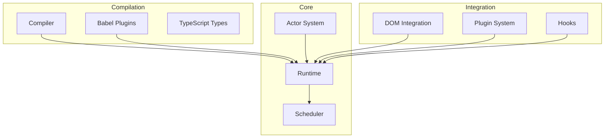
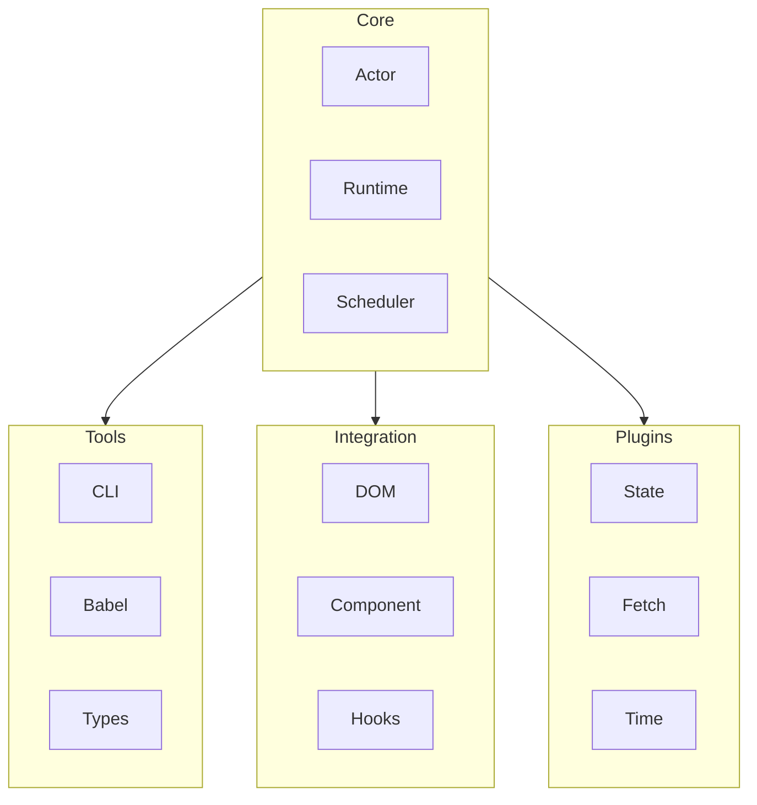
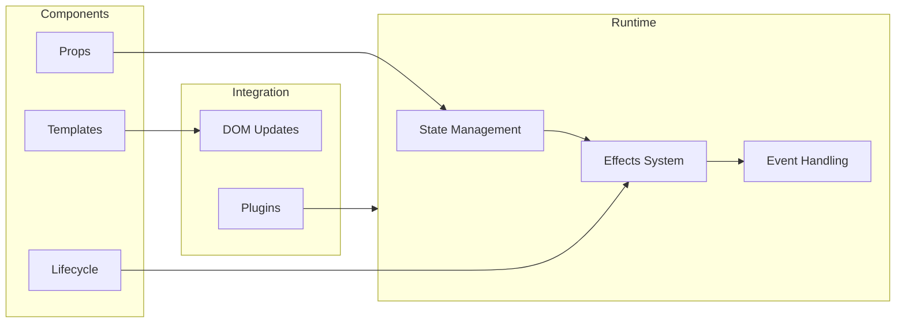

# System Patterns

## Architecture Overview

## Core Patterns

### 1. Actor System
- Message-based communication
- Isolated state management
- Controlled side effects
- Concurrent execution model

### 2. Reactive Runtime
- Fine-grained dependency tracking
- Efficient change propagation
- Smart effect scheduling
- Resource lifecycle management

### 3. Component Model
- Declarative UI definition
- Reactive state binding
- Lifecycle management
- Event handling system

## Design Patterns

### 1. Reactive Programming
- Observable state
- Computed properties
- Side effects
- Event streams

### 2. Message Passing
- Actor communication
- Event propagation
- State updates
- Error handling

### 3. Plugin Architecture
- Standardized extension points
- Feature modules
- Configuration system
- Resource management

## Implementation Patterns

### 1. Package Organization

### 2. Type System
- Strong type safety
- Generic constraints
- Union types
- Type inference

### 3. Testing Strategy
- Unit testing core logic
- Integration testing plugins
- Performance benchmarking
- Type testing

## Component Relationships

## Development Patterns

### 1. Code Organization
- Feature-based structure
- Clear module boundaries
- Consistent naming
- Documentation standards

### 2. Error Handling
- Error boundaries
- Recovery strategies
- Error reporting
- Debugging support

### 3. Performance Optimization
- Dependency optimization
- Update batching
- Resource pooling
- Memory management
