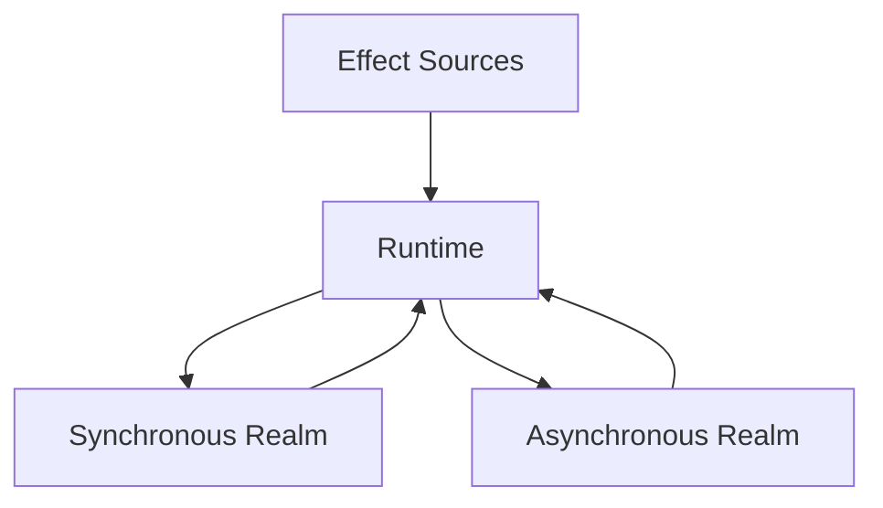
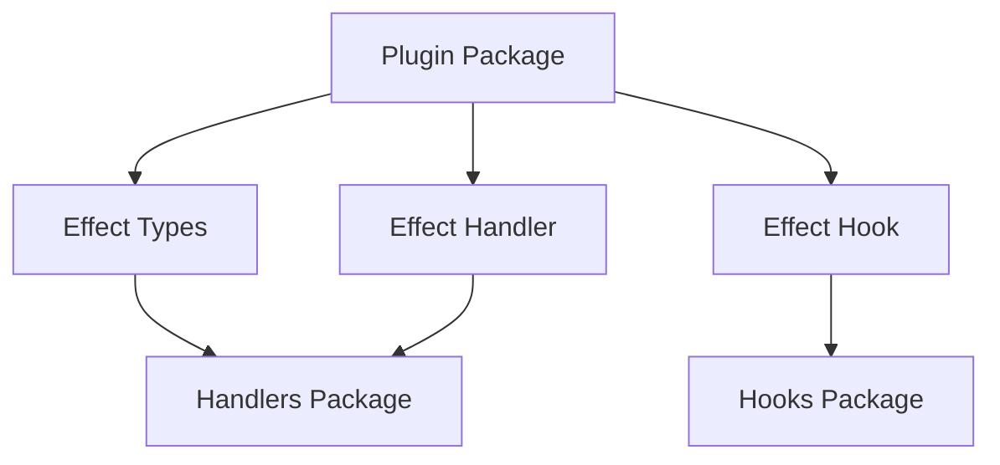
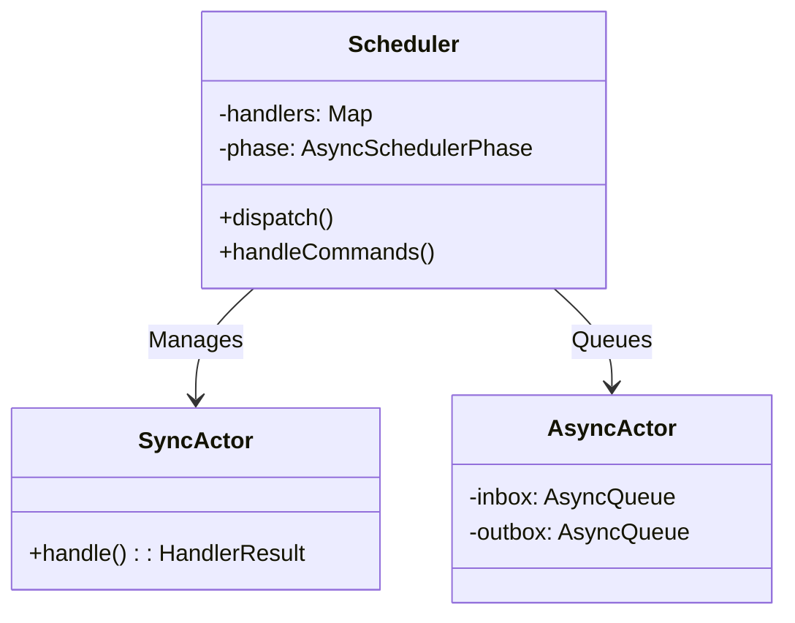

# Technical Context

## Technology Stack
- Primary Language: TypeScript
- Package Management: pnpm (workspace/monorepo setup)
- Build Tools: Vite, Babel

## Package Architecture

### Core Runtime Packages
- `packages/runtime`: Top-level runtime scheduler
- `packages/interpreter`: Core interpreter implementation
- `packages/compiler`: Standalone reactive function compiler
- `packages/babel-preset-reactive`: Babel preset for compilation (based on Regenerator)

### Actor System
- `packages/actor`: Core actor framework types
- `packages/actor-utils`: Actor utility helpers
- `packages/scheduler`: Actor scheduler implementation
- `packages/runtime-messages`: Well-known runtime message types

### Development Tools
- `packages/cli`: CLI runtime environment
- `packages/loader`: ESM loader
- `packages/build-config`: Shared build configuration

### UI Integration
- `packages/component`: JSX component system helpers
- `packages/dom`: DOM renderer runtime environment

### Plugin System
Core Plugins:
- `packages/plugin-evaluate`: Runtime implementation
- `packages/plugin-fetch`: HTTP transport
- `packages/plugin-fs`: Filesystem operations
- `packages/plugin-pending`: Pending state fallbacks
- `packages/plugin-state`: Stateful variables
- `packages/plugin-time`: Time-related effects

### Utility Packages
- `packages/handler-utils`: Effect Handler utilities
- `packages/handlers`: All-in-one handler package
- `packages/hooks`: All-in-one hooks package
- `packages/hash`: Hash utility library
- `packages/reactive-utils`: Effect stream transformations
- `packages/types`: Shared core types
- `packages/utils`: General utilities

## Development Setup

### Package Generation
Two types of package templates available via `pnpm generate`:
1. Basic Package (`pnpm generate package`)
   - Basic TypeScript package setup
   - Standard build configuration
   - Test infrastructure

2. Plugin Package (`pnpm generate plugin`)
   - Extends basic package template
   - Adds plugin-specific exports:
     - effects
     - handlers
     - hooks
     - messages
     - types
   - Automatically adds required dependencies
   - Updates hooks and handlers packages

### Plugin Development
Plugins must implement standardized interfaces:
- Effects: Define new effect types
- Handlers: Implement effect handling logic
- Hooks: Provide reactive function integration

Plugin Constraints:
- All asynchronous behavior must be message-based
- Must follow actor system patterns
- Must integrate with dependency tracking system

### Build System
- Uses Vite for modern build tooling
- Babel integration for reactive function compilation
- Workspace-aware dependency management
- Standardized build configs across packages

### Testing Infrastructure
Currently implementing:
1. Asynchronous Testing
   - Handler message sequence verification
   - Canned message sequence playback

2. Synchronous Testing
   - Reactive function mounting
   - Effect state simulation

3. Integration Testing
   - Combined async/sync testing
   - Mock effect handler support
   - Deterministic behavior verification 

## Core Architecture

### Dependency Tracking System
- Performs computation via dependency-tracked reactive functions 
- Maintains complete causal chains across system boundaries
- Enables advanced debugging and monitoring capabilities
- Links events across systems (UI → server → deployment → build → git commit)

### Dual-Realm Design


1. Synchronous Realm
   - Pure computation layer
   - Reactive functions compute values based on current state
   - All side effects abstracted through hooks
   - Deterministic output for given inputs
   - Similar to React's render phase

2. Asynchronous Realm
   - Message-driven actor system
   - Handlers respond to subscriptions/unsubscriptions
   - All async behavior reified as messages
   - Deterministic response to message sequences
   - Similar to Redux saga/effects pattern

### Runtime Coordination
- Runtime acts as bridge between realms
- Tracks active effect subscriptions
- Manages dependency graph updates
- Schedules re-computation of affected values
- Ensures causal chain tracking

## Key Design Patterns

### Effect Pattern
```typescript
interface Effect<T> {
  type: symbol;        // Unique effect type identifier
  payload: unknown;    // Effect-specific configuration
  result: T;          // Type of effect result
}
```

- Effects are declarative descriptions of side effects
- Each effect type has associated handler and hook
- Effects are pure data structures
- Runtime resolves effects to handlers

### Handler Pattern
```typescript
class EffectHandler extends Handler {
  onSubscribe(effect: Effect): void
  onUnsubscribe(effect: Effect): void
  onMessage(msg: Message): void
}
```

- Handlers implement effect behavior
- Message-based communication
- Maintain subscription state
- Emit effect value updates

### Hook Pattern
```typescript
async function useEffect<T>(
  effect: Effect<T>
): Promise<T> {
  // Subscribe to effect
  // Return current value
  // Unsubscribe on cleanup
}
```

- Hooks provide sync realm access to effects
- Must be called from reactive functions
- Manage effect lifecycle
- Cache effect values

### Higher-Order Effects
```typescript
interface ReducerEffect<T, R> extends Effect<R> {
  type: typeof EFFECT_TYPE_REDUCER;
  payload: {
    source: Effect<T>;
    reducer: (acc: R, value: T) => R;
    initial: R;
  };
}

// Usage example
const countEffect = createReducerEffect({
  source: someNumberEffect,
  reducer: (count, value) => count + 1,
  initial: 0
});
```

- Higher-order effects transform other effects
- Can compose multiple effects together
- Maintain referential transparency
- Handle cleanup automatically

## Plugin Architecture

### Plugin Components
1. Effect Definitions
   - Define new effect types
   - Specify payload schema
   - Define result type

2. Effect Handler
   - Implement effect behavior
   - Handle subscriptions
   - Process messages
   - Emit updates

3. Hook Implementation
   - Provide reactive function interface
   - Handle effect lifecycle
   - Cache results

### Plugin Integration


## Testing Patterns

### Handler Testing
```typescript
test('handler behavior', async () => {
  const handler = new TestHandler();
  await handler.processMessages([
    Subscribe(effect),
    CustomMessage(data),
    Unsubscribe(effect)
  ]);
  expect(handler.emittedMessages).toEqual([
    // Expected message sequence
  ]);
});
```

### Reactive Function Testing
```typescript
test('reactive computation', async () => {
  const result = await mount(
    async () => {
      const value = await useEffect(effect);
      return transform(value);
    },
    {
      effects: {
        [effectType]: mockHandler
      }
    }
  );
  expect(result).toEqual(expected);
});
```

## Actor System Fundamentals



### Key Characteristics
- **Handle Management**:
  - Opaque identifiers generated by scheduler
  - Central registry in scheduler's `handlers` Map
  - No direct actor→actor communication without handle exchange

- **Lifecycle Hooks**:
  1. Subscription tracking through effect IDs
  2. Automatic task cleanup on unsubscribe
  3. Parent/child relationships via spawn/kill

- **Async Constraints**:
  - Limited to parent handle communication
  - No direct sibling/cousin actor access
  - External I/O isolation through specialized handlers

- **Message Processing**:
  - Sync actors: Immediate message handling
  - Async actors: Queue-based processing
  - Strict parent/child communication hierarchy
