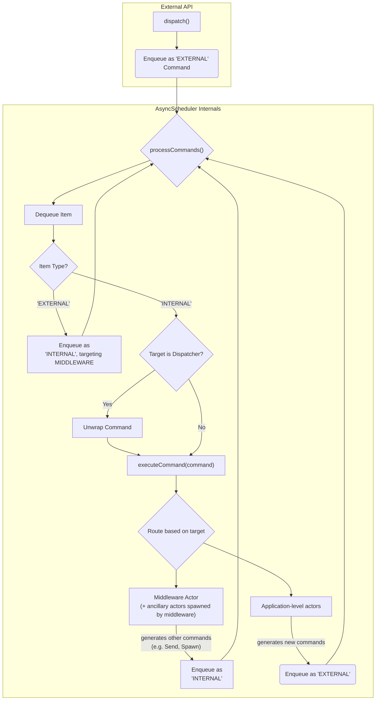

# Scheduler Middleware

## Introduction

This proposal introduces a middleware system for the `AsyncScheduler`. This system will enable the interception and processing of scheduler commands, providing a powerful mechanism for implementing advanced features such as logging, testing, monitoring, and other application-specific logic. Middleware will be able to inspect, transform, block, or inject commands, offering a flexible extension point for controlling the scheduler's behavior without modifying its core implementation.

## Motivation

The `AsyncScheduler` currently supports a basic middleware callback (`(command) => void`), which allows for observing commands as they are processed. While useful for simple logging, this implementation is limited:

-   **No Transformation**: It cannot modify command payloads.
-   **No Blocking**: It cannot prevent a command from being executed.
-   **No Injection**: It cannot introduce new commands into the stream.
-   **No Composition**: There is no standardized way to chain multiple callbacks.

To enable more advanced features like task mocking, command validation, and sophisticated monitoring, a more powerful middleware system is required. This proposal introduces a new actor-based middleware architecture designed to overcome these limitations, providing a robust and flexible extension point for controlling the scheduler's behavior. This change represents an upgrade to the existing functionality, introducing a breaking change to the `AsyncScheduler` constructor in favor of a more capable and idiomatic API.

## Core Concepts

- **Middleware as Actors**: Each middleware is an `Actor` that processes higher-order messages that wrap `SchedulerCommand<T>` commands. This aligns the middleware system with ReactiveKit's core architecture, granting it the full power of the actor model, including the ability to spawn child actors for asynchronous operations.
- **Actor Chaining**: Tools are provided to chained together middlewares as a pipeline of actors. Each actor receives a command, processes it, and sends the resulting command(s) to the next actor in the chain.
- **Command Wrapping**: To avoid message type collisions within a middleware actor's inbox (which might need to handle its own internal messages), scheduler commands are wrapped in a `SchedulerCommandMessage<T>`.
- **Asynchronous Logic**: Middleware actors remain synchronous. To perform asynchronous operations (e.g., database lookups), a middleware spawns a dedicated, temporary child actor. The middleware blocks the original command and waits for a result message from the child before continuing the chain.

### Internal vs External actors

The middleware system necessitates a differentiation between *internal* and *external* actors:

- **External Actors**: Application-level actors spawned by the root actor factory and their spawned children
- **Internal Actors**: Middleware actors and their spawned children

An actor's context is 'sticky': all child actors spawned by an external actor will themselves be external actors, and all child actors spawned by an internal actor will be internal actors.

This allows composing complex middleware pipelines while maintaining a clean log of application-level actions, and helps avoid infinite middleware loops.

The scheduler initiates termination when the final remaining non-middleware actor is killed or fails.

### Scheduler control flow



## Scheduler Termination

When middleware is configured, the scheduler's termination process ensures graceful shutdown while allowing middleware to participate in the termination lifecycle.

### Termination Flow Overview

The scheduler initiates termination when the final non-middleware actor is removed.

When no middleware is present, this causes the scheduler iteration to complete after all messages already in the output queue have been consumed.

When middleware is present, the termination proceeds as follows:

1. **Termination Detection**: The scheduler detects when the number of application-level actors drops to zero, emitting a `Terminate` command
2. **Middleware Processing**: The `Terminate` command is sent through the middleware pipeline as an external command
3. **Middleware Participation**: Middleware can intercept, log, transform, or delay the termination request
4. **Graceful Completion**: Once a `Terminate` command is received from the middleware, the scheduler closes the output queue, which causes iteration to complete once all messages already in the output queue have been consumed

This provides a structured approach to application shutdown, allowing fine-grained control of termination conditions and orchestrated cleanup of both synchronous and asynchronous resources.

## Usage Examples

#### 1. Logging Middleware
Observes commands without altering behavior.

```typescript
import {
  Actor,
  ActorHandle,
  HandlerContext,
  HandlerAction,
} from '@reactive-kit/actor';
import {
  SchedulerCommand,
  SchedulerCommandMessage,
  SchedulerMiddlewareFactory,
} from '@reactive-kit/scheduler';

function createLoggingMiddleware<T>(
  logger: (message: string) => void,
): SchedulerMiddlewareFactory<T> {
  return {
    type: 'LoggingMiddleware',
    async: false,
    factory: (next: ActorHandle<SchedulerCommandMessage<T>>) => ({
      // The actor's handle method processes incoming messages.
      handle(message: SchedulerCommandMessage<T>, context: HandlerContext<any>) {
        logger(`[Scheduler] Processing command: ${message.payload.type}`);
        // Send the wrapped command to the next middleware in the chain.
        return [HandlerAction.Send({ target: next, message })];
      },
    }),
  };
}
```

### 2. Task-Mocking Middleware
Replaces `SPAWN` commands for testing purposes.

```typescript
import { ActorFactory } from '@reactive-kit/actor';
import {
  SchedulerCommand,
  SchedulerCommandMessage,
  SchedulerMiddlewareFactory,
} from '@reactive-kit/scheduler';

function createMockingMiddleware<T>(
  taskType: string,
  mockTaskFactory: ActorFactory<any, any, any>,
): SchedulerMiddlewareFactory<T> {
  return {
    type: 'MockingMiddleware',
    async: false,
    factory: (next: ActorHandle<SchedulerCommandMessage<T>>) => ({
      handle(message: SchedulerCommandMessage<T>, context: HandlerContext<any>) {
        const { payload: command } = message;
        if (
          SchedulerCommand.Spawn.is(command) &&
          command.actor.type === taskType
        ) {
          const mockCommand: SchedulerCommand<T> = SchedulerCommand.Spawn({
            ...command,
            actor: mockTaskFactory,
          });
          // Send the modified command, wrapped in our message type.
          const modifiedMessage: SchedulerCommandMessage<T> = {
            ...message,
            command: mockCommand,
          };
          return [HandlerAction.Send({ target: next, message: modifiedMessage })];
        }
        // For all other commands, pass them through unchanged.
        return [HandlerAction.Send({ target: next, message })];
      },
    }),
  };
}
```

### 3. Asynchronous Validation Middleware
Spawns a child actor to perform asynchronous validation, demonstrating the full power of this pattern.

First, we define the message types the middleware actor will handle. It needs to process commands from the scheduler *and* results from its own validator child.

```typescript
import {
  Actor,
  ActorHandle,
  HandlerContext,
  HandlerAction,
  HandlerResult,
} from '@reactive-kit/actor';
import {
  SchedulerCommand,
  SchedulerCommandMessage,
  SchedulerMiddlewareFactory,
} from '@reactive-kit/scheduler';

// Message sent from the validator child back to the middleware parent.
interface ValidationWorkerRequest<T> {
  type: 'VALIDATION_WORKER_REQUEST';
  payload: {
    originalMessage: T;
    workerId: string;
  };
}

interface ValidationWorkerResponse<T> {
  type: 'VALIDATION_WORKER_RESPONSE';
  payload: {
    workerId: string;
    originalMessage: T;
    isInvalid: boolean;
  };
}

type ValidationWorkerMessage<T> =
  | ValidationWorkerRequest<T>
  | ValidationWorkerResponse<T>;

// Message sent to the original target with validation results
interface ValidationResultMessage<T> {
  type: 'VALIDATION_RESULT';
  payload: {
    value: T;
    isInvalid: boolean;
  };
}

// The full set of messages the middleware actor can receive.
type ValidationMiddlewareInput<T> = SchedulerCommandMessage<T> | ValidationWorkerMessage<T> | SchedulerCommandMessage<ValidationResultMessage<T>>;
```

Now, the middleware actor itself:

```typescript
class ValidationWorker<T>
  implements Actor<ValidationWorkerMessage<T>, ValidationWorkerMessage<T>>
{
  constructor(private callback: ActorHandle<ValidationWorkerMessage<T>>) {}

  handle(
    message: ValidationWorkerMessage<T>,
    context: HandlerContext<ValidationWorkerMessage<T>>,
  ): HandlerResult<ValidationWorkerMessage<T>> {
    if (message.type === 'VALIDATION_WORKER_REQUEST') {
      const { originalMessage, workerId } = message.payload;
      // Simulate async validation work - check if message contains 'invalid'
      const isInvalid = (originalMessage as any).payload?.includes('invalid') || false;
      // Send response back to the caller and then kill self
      return [
        HandlerAction.Send({
          target: this.callback,
          message: {
            type: 'VALIDATION_WORKER_RESPONSE',
            payload: {
              workerId,
              originalMessage,
              isInvalid,
            },
          } satisfies ValidationWorkerResponse<T>,
        }),
        HandlerAction.Kill({ target: context.self() }),
      ];
    }
    return null;
  }
}

class ValidationMiddleware<T>
  implements Actor<ValidationMiddlewareInput<T>, ValidationMiddlewareInput<T>>
{
  private workerCount = 0;
  private pendingWorkers = new Map<
    string,
    {
      target: ActorHandle<T | ValidationResultMessage<T>>;
      message: T;
    }
  >();

  constructor(private next: ActorHandle<ValidationMiddlewareInput<T>>) {}

  handle(
    message: ValidationMiddlewareInput<T>,
    context: HandlerContext<ValidationMiddlewareInput<T>>,
  ) {
    // Case 1: Handle messages to validate by spawning validation workers
    if (
      isSchedulerCommandMessage(message) &&
      SchedulerCommand.Send.is(message.payload) &&
      (message.payload.message as any).type === 'CREATE_USER'
    ) {
      const workerId = `worker-${this.workerCount++}`;
      const originalMessage = message.payload.message;
      this.pendingWorkers.set(workerId, {
        target: message.payload.target,
        message: originalMessage,
      });
      
      // Create a validation worker
      const workerHandle = context.spawn({
        actor: {
          type: 'ValidationWorker',
          async: false,
          factory: (next: ActorHandle<ValidationWorkerMessage<T>>) =>
            new ValidationWorker(next),
        },
        config: context.self(),
      });
      
      return [
        // Pass the original message through
        HandlerAction.Send({ target: this.next, message }),
        // Spawn validation worker
        HandlerAction.Spawn({ target: workerHandle }),
        // Send validation request to worker
        HandlerAction.Send({
          target: workerHandle,
          message: {
            type: 'VALIDATION_WORKER_REQUEST',
            payload: {
              originalMessage,
              workerId,
            },
          },
        }),
      ];
    }

    // Case 2: Handle worker responses
    if (
      !isSchedulerCommandMessage(message) &&
      message.type === 'VALIDATION_WORKER_RESPONSE'
    ) {
      const workerResponse = message;
      const { workerId, originalMessage, isInvalid } = workerResponse.payload;

      // Remove from pending workers
      const pendingWorker = this.pendingWorkers.get(workerId);
      if (!pendingWorker) return [];
      const { target: originalTarget } = pendingWorker;
      this.pendingWorkers.delete(workerId);
      
      // Send validation result message to next middleware
      return [
        HandlerAction.Send({
          target: this.next,
          message: createSchedulerCommandMessage(
            SchedulerCommand.Send<ValidationResultMessage<T>>({
              source: context.self() as ActorHandle<unknown> as ActorHandle<ValidationResultMessage<T>>,
              target: originalTarget as ActorHandle<ValidationResultMessage<T>>,
              message: {
                type: 'VALIDATION_RESULT',
                payload: {
                  value: originalMessage,
                  isInvalid,
                },
              },
            }),
          ),
        }),
      ];
    }

    // Case 3: Pass through other messages unchanged
    return [HandlerAction.Send({ target: this.next, message })];
  }
}
```

### 4. Termination callback

```typescript
import {
  ActorHandle,
  HandlerContext,
  HandlerAction,
} from '@reactive-kit/actor';
import {
  SchedulerCommand,
  SchedulerCommandMessage,
  SchedulerMiddlewareFactory,
} from '@reactive-kit/scheduler';

function createShutdownActionMiddleware<T>(
  callback: () => void,
): SchedulerMiddlewareFactory<T> {
  return {
    type: 'ShutdownActionMiddleware',
    async: false,
    factory: (next: ActorHandle<SchedulerCommandMessage<T>>) => ({
      handle(message: SchedulerCommandMessage<T>, context: HandlerContext<any>) {
        const { payload: command } = message;
        // If this is a shutdown request, invoke the callback
        if (SchedulerCommand.Terminate.is(command)) callback();
        // Forward the command to the next middleware
        return [HandlerAction.Send({ target: next, message })];
      },
    }),
  };
}
```

### 5. Asynchronous termination cleanup

```typescript
import {
  ActorHandle,
  HandlerAction,
  AsyncTask,
} from '@reactive-kit/actor';
import {
  SchedulerCommand,
  SchedulerCommandMessage,
  SchedulerMiddlewareFactory,
} from '@reactive-kit/scheduler';

function createAsyncShutdownActionMiddleware<T>(
  cleanup: () => Promise<void>,
): SchedulerMiddlewareFactory<T> {
  return {
    type: 'AsyncShutdownActionMiddleware',
    async: false,
    factory: (
      next: ActorHandle<SchedulerCommandMessage<T>>,
    ): AsyncTask<SchedulerCommandMessage<T>, SchedulerCommandMessage<T>> => {
      return async (inbox, outbox) => {
        for await (const message of inbox) {
          const { payload: command } = message;
          // If this is a shutdown request, perform asynchronous cleanup actions before proceeding
          if (SchedulerCommand.Terminate.is(command)) await cleanup();
          // Forward the command to the next middleware
          outbox(HandlerAction.Send({ target: next, message }));
        }
      };
    },
  };
}
```

## Detailed Design & API

### 1. `SchedulerMiddlewareFactory<T>` / `SchedulerMiddlewareActor<T>`
The core of the system is the `SchedulerMiddlewareActor<T>` interface, which is created via a `SchedulerMiddlewareFactory<T>`.

```typescript
import { Actor, ActorHandle } from '@reactive-kit/actor';
import { SchedulerCommand } from '@reactive-kit/scheduler';

export interface SchedulerMiddlewareActor<T> extends Actor<SchedulerCommandMessage<T>, SchedulerCommandMessage<T>> {}

export type SchedulerMiddlewareFactory<T> = ActorFactory<
  ActorHandle<SchedulerCommandMessage<T>>,
  SchedulerCommandMessage<T>,
  SchedulerCommandMessage<T>
>;
```

### 2. `SchedulerCommandMessage<T>`
The message wrapper type for all commands passing through the middleware chain.

```typescript
export interface SchedulerCommandMessage<T> {
  type: typeof MESSAGE_SCHEDULER_COMMAND;
  payload: SchedulerCommand<T>;
};
```

### 3. Middleware Composition
To maintain separation of concerns, the `AsyncScheduler` will not be responsible for composing middleware. Instead, composition will be handled externally using a new `chainMiddleware` utility that creates a higher-order `ChainSchedulerMiddlewareActor`.

The `ChainSchedulerMiddlewareActor` is an orchestrator. When initialized, it spawns and connects the `left` and `right` middleware actors. Its own `handle` method just serves as the entry point to the chain.

```typescript
import { Actor, ActorHandle, HandlerContext, HandlerAction } from '@reactive-kit/actor';
import { SchedulerCommandMessage, SchedulerMiddlewareFactory } from '@reactive-kit/scheduler';

class ChainSchedulerMiddlewareActor<T> implements SchedulerMiddlewareActor<T> {
  private leftActorHandle: ActorHandle<SchedulerCommandMessage<T>> | null = null;

  constructor(
    private left: SchedulerMiddlewareFactory<T>,
    private right: SchedulerMiddlewareFactory<T>,
    private next: ActorHandle<SchedulerCommandMessage<T>>
  ) {}

  public init(context: HandlerContext<any>): void {
    // The 'right' actor is created first, pointing to the final 'next' handle.
    const rightActorCreator = configureActorFactory(this.right, this.next);
    const rightActorHandle = context.spawn(rightActorCreator);
    // The 'left' actor is created second, pointing to the 'right' actor.
    const leftActorCreator = configureActorFactory(this.left, rightActorHandle);
    // The handle to the 'left' actor is stored for the 'handle' method.
    this.leftActorHandle = context.spawn(leftActorCreator);
  }

  public handle(message: SchedulerCommandMessage<T>, context: HandlerContext<any>) {
    if (!this.leftActorHandle) throw new Error('ChainSchedulerMiddlewareActor not initialized.');
    // Forward all incoming commands to the start of the chain.
    return [HandlerAction.Send({ target: this.leftActorHandle, message })];
  }
}
```

The user-facing `chainMiddleware`, `composeMiddleware` and `identityMiddleware` utilities are provided as syntactic sugar:

```typescript
export function chainMiddleware<T>(
  left: SchedulerMiddlewareFactory<T>,
  right: SchedulerMiddlewareFactory<T>
): SchedulerMiddlewareFactory<T> {
  // Return a new ActorFactory that creates our ChainSchedulerMiddlewareActor.
  return {
    type: 'ChainMiddleware',
    async: false,
    factory: (next: ActorHandle<SchedulerCommandMessage<T>>) =>
      new ChainSchedulerMiddlewareActor(left, right, next),
  };
}

export function composeMiddleware<T>(
  ...factories: Array<SchedulerMiddlewareFactory<T>>
): SchedulerMiddlewareFactory<T> {
  if (factories.length === 0) return identityMiddleware();
  if (factories.length === 1) return factories[0];
  return factories.reduce(chain);
}

export function identityMiddleware<T>(): SchedulerMiddlewareFactory<T> {
  return {
    type: 'IdentityMiddleware',
    async: false,
    factory: (next: ActorHandle<SchedulerCommandMessage<T>>) =>
      new IdentitySchedulerMiddlewareActor(left, right, next),
  }

}

// Example of user-side composition:
const myMiddleware = compose(
    createLoggingMiddleware(console.log),
    createMockingMiddleware('some-task', mockTask)
);
```

This composition creates a linked list of actors, where each `send` to the `next` handle passes the command down the pipeline, until it reaches the final internal dispatcher.

### 4. `IdentitySchedulerMiddlewareActor<T>`

This is a trivial 'passthrough' middleware actor that immediately emits any received messages without applying any transformations.

```typescript
class IdentitySchedulerMiddlewareActor<T> implements SchedulerMiddlewareActor<T> {
  constructor(
    private next: ActorHandle<SchedulerCommandMessage<T>>
  ) {}

  public handle(message: SchedulerCommandMessage<T>, context: HandlerContext<any>) {
    // Forward all incoming commands directly to the outbox
    return [HandlerAction.Send({ target: this.next, message })];
  }
}
```

### 5. `AsyncScheduler` Integration and Composition
The `AsyncScheduler` constructor will be updated to accept a single, optional `middleware` factory.

```typescript
declare class AsyncScheduler<T> {
  constructor(
    factory: (context: HandlerContext<T>) => ActorFactory<ActorHandle<T>, T, T>,
    middleware?: SchedulerMiddlewareFactory<T>
  );
}

const scheduler = new AsyncScheduler(rootActor, myMiddleware);
```

This allows a user to construct a sophisticated pipeline and pass the final, composed middleware factory to the scheduler.

## Future Work

-   **Context Propagation**: To enable more advanced scenarios where middlewares need to share information, the `SchedulerCommandMessage` could be augmented with a shared `context` object. This would allow middlewares to communicate with each other or access shared resources without adding data to the command payload itself, providing a cleaner separation of concerns.
-   **Error Handling**: There is currently no error handling specific to the middleware mechanism itself – e.g. it is currently assumed that middleware actors will not throw unhandled exceptions. Given that application-level error reporting in user-provided actors will likely be handled by error fallback middleware, this will need to be tackled as part of a larger 'error handling' proposal.
