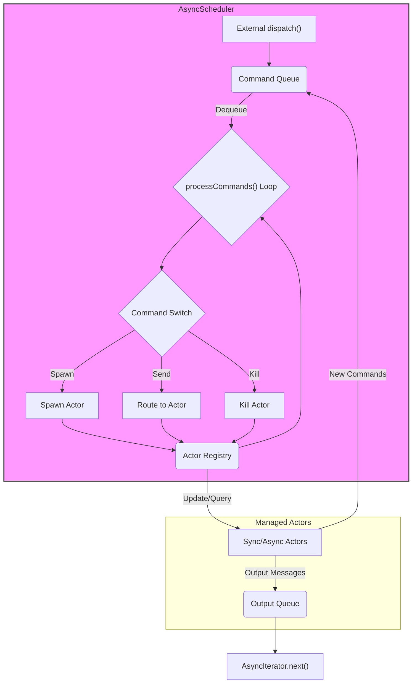
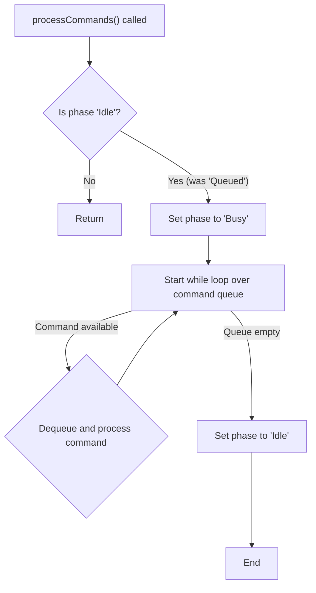
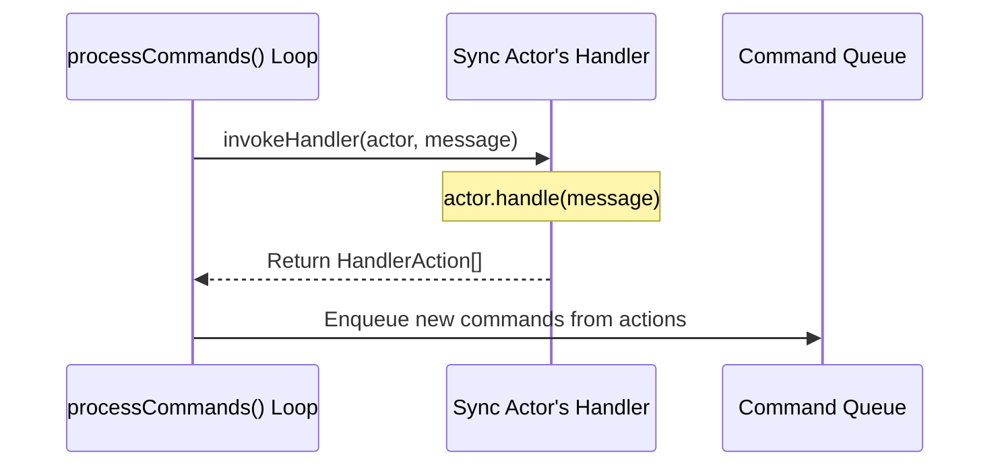
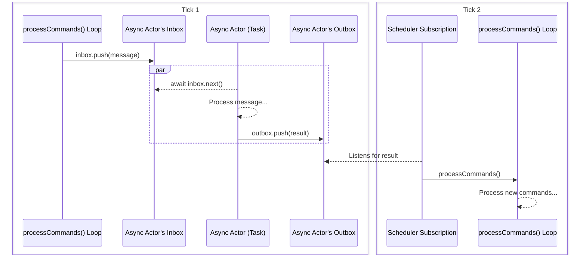

### `Scheduler` Internals

The `AsyncScheduler` is the heart of the `@reactive-kit/actor` model, functioning as a central message bus, actor lifecycle manager, and deterministic command processor. Its primary goal is to ensure that all interactions within the actor system occur in a predictable and traceable order.

#### High-Level Architecture

At a high level, the scheduler receives commands, processes them sequentially from a queue, and manages a collection of stateful actors. External code can dispatch messages into the scheduler and consume output messages via an async iterator interface.

---

#### Core Components

The scheduler's logic is built around a few key internal components:

1.  **`handlers: Map<AsyncSchedulerActorHandle<T>, ActorState<T>>`**: This is the central actor registry. It maps an `AsyncSchedulerActorHandle` to an `ActorState`, which is a discriminated union indicating whether the actor is synchronous (`Sync`) or asynchronous (`Async`). This distinction is critical to how messages are processed.
2.  **`phase: AsyncSchedulerPhase<T>`**: This is a simple state machine (`Idle`, `Queued`, `Busy`) that ensures the command queue is processed atomically. It prevents re-entrant processing, meaning a `dispatch()` call that occurs while the scheduler is already busy will simply add commands to the queue without starting a new processing loop.
3.  **Command Queue**: This is not a distinct data structure but rather a simple array (`queue`) that is a property of the `Queued` and `Busy` phases. It operates as a standard First-In, First-Out (FIFO) queue.
4.  **`inputHandle` & `outputHandle`**: These are special, internally-managed actor handles. The `inputHandle` is the default target for externally dispatched messages, typically routing to the "root" actor. Messages sent to the `outputHandle` are pushed to an `outputQueue`, making them available to external consumers of the scheduler's async iterator.

---

#### The Command Processing Lifecycle

The processing of commands is the scheduler's main responsibility. The control flow is designed to be robust and deterministic.

**1. Command Enqueueing**

Any new work for the scheduler is first converted into one or more `AsyncSchedulerCommand`s and enqueued. This happens in two primary ways:

*   **External `dispatch(message: T)`**: An external message is wrapped in a `Send` command targeting the `inputHandle` and passed to `enqueueCommands()`.
*   **Internal Actor Execution**: Actors, when handling a message, can return `HandlerAction`s, which are then converted into new `AsyncSchedulerCommand`s and also passed to `enqueueCommands()`.

The `enqueueCommands()` method adds the new commands to the queue within the current `phase`.

**2. The `processCommands()` Loop**

This method is the engine of the scheduler. Its control flow is governed by the `phase` state machine:

This design ensures that only one "thread" of command processing can be active at a time. The core of this method is the `while` loop that iterates over the command queue until it's empty. Inside the loop, a `switch` statement routes each command to the appropriate handler logic.

---

#### Message Flow and Actor Handling

How a `Send` command is handled depends entirely on whether its target actor is synchronous or asynchronous.

##### Synchronous Actors

When a message is sent to a synchronous actor, the entire execution happens immediately within the current iteration of the `processCommands` loop.

1.  The `switch` statement identifies the `Send` command.
2.  It retrieves the `ActorState.Sync` from the `handlers` map.
3.  It calls `invokeHandler()`, passing in the actor instance, its context, and the message.
4.  `invokeHandler()` directly calls the actor's `handle()` method.
5.  The `handle()` method runs its logic and returns an array of `HandlerAction`s (or `null`).
6.  `invokeHandler()` converts these actions back into `AsyncSchedulerCommand`s.
7.  Back in `processCommands`, these new commands are pushed onto the *end* of the command queue and will be processed in subsequent iterations of the current `while` loop.

##### Asynchronous Actors

When a message is sent to an asynchronous actor, the scheduler's role is to deliver the message without blocking its own command processing loop. This decouples the long-running async task from the main, synchronous event loop, but the scheduler remains responsible for processing the results of that task when they are ready.

This is a two-tick process, first to dispatch the message to the actor, then to process any resulting messages received from the actor:

1.  During the first `processCommands` loop, the `switch` statement identifies the `Send` command targeting an async actor.
2.  It retrieves the `ActorState.Async` from the `handlers` map.
3.  It pushes the message into that actor's private `inbox` (an `AsyncQueue`).
4.  The `processCommands` loop immediately continues to the next command in its queue. The scheduler does not wait for the async actor to handle the message.
5. Meanwhile, the `AsyncTask` `await`s the message from its `inbox`
6. *[some time passes]*
7.  The `AsyncTask` reads the message from its `inbox`, performs its work (e.g., an I/O operation), and eventually pushes a result (an `AsyncTaskResult`, which is an array of `HandlerAction`s) to its `outbox`.
8.  When the scheduler first spawned the async actor, it also created a subscription to the actor's `outbox`. When the result is pushed to the `outbox`, this subscription is triggered. The callback for this subscription:
    1.  Receives the `AsyncTaskResult`.
    2.  Converts the `HandlerAction`s into new `AsyncSchedulerCommand`s.
    3.  Calls `enqueueCommands()` with these new commands.
    4.  Immediately calls `processCommands()`, which starts a *second* processing loop to handle the results from the async actor.

This clear separation ensures that long-running I/O-bound tasks in async actors do not block the synchronous, deterministic execution of the rest of the system, while still allowing those actors to feed new commands back into the scheduler in a predictable manner.
